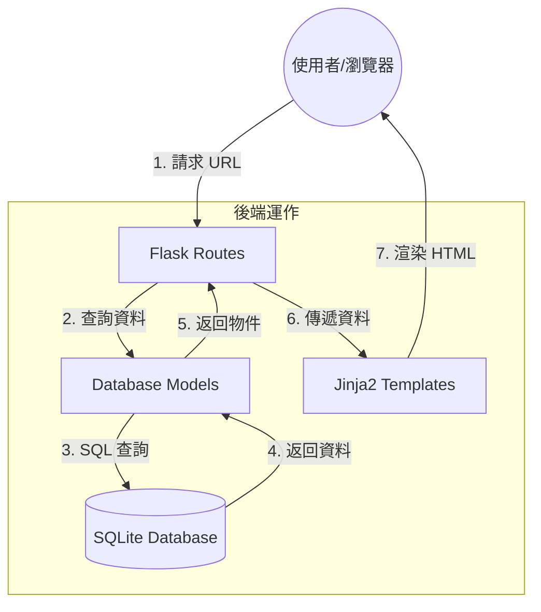

# 追劇推薦系統系統架構文件 (Architecture Document)

本文件根據 [PRD.md](file:///c:/Users/User/Desktop/web_app_development2/docs/PRD.md) 規劃，旨在定義「追劇推薦系統」的技術架構與開發規範。

## 1. 技術架構說明

本專案採用經典的 **MVC (Model-View-Controller)** 模式進行開發，並使用 Flask 框架實現伺服器端渲染 (SSR)。

### 選用技術與原因
- **後端：Python + Flask**
  - 原因：Flask 輕量且靈活，適合快速原型開發，並提供豐富的擴充套件。
- **模板引擎：Jinja2**
  - 原因：Flask 內建支援，能直接在 HTML 中處理邏輯與變數，實現前後端無縫協作。
- **資料庫：SQLite**
  - 原因：輕量級檔案型資料庫，不需要安裝額外的伺服器，非常適合中小型應用程式與開發初期使用。

### MVC 模式說明
- **Model (模型)**：
  - 負責資料邏輯與資料庫互動。定義劇集、演員、分類等資料表結構。
- **View (視圖)**：
  - 負責介面呈現。使用 Jinja2 模板動態生成 HTML，讓使用者能看到資料。
- **Controller (控制器)**：
  - 負責業務邏輯與請求轉發。由 Flask 路由 (Routes) 擔任，接收使用者的點擊或輸入，向 Model 要求資料，並決定要渲染哪個 View。

---

## 2. 專案資料夾結構

建議結構如下，確保程式碼結構清晰、易於維護：

```text
drama_recommend/
├── app/
│   ├── models/          # 【Model】資料庫模型 (如：drama.py, actor.py)
│   ├── routes/          # 【Controller】Flask 路由與邏輯 (如：main.py, api.py)
│   ├── templates/       # 【View】Jinja2 HTML 模板
│   │   ├── base.html    # 網頁共用外框
│   │   ├── index.html   # 首頁 (推薦榜單)
│   │   └── detail.html  # 劇集詳情頁
│   └── static/          # 靜態資源 (CSS, JS, 圖片)
│       ├── css/
│       └── js/
├── docs/                # 專案文件 (PRD, ARCHITECTURE)
├── instance/            # 存放 SQLite 資料庫實體檔案 (不進入 Git)
│   └── database.db
├── app.py               # 專案入口檔案 (啟動 Flask App)
├── requirements.txt     # Python 套件依賴清單
└── config.py            # 系統設定檔
```

---

## 3. 元件關係圖

以下展示了資料從使用者請求到回傳頁面的流向：



---

## 4. 關鍵設計決策

1. **單體伺服器端渲染 (Monolithic SSR)**：
   - 決策：不採用前後端分離（如 React/Vue + API），而是直接用 Flask + Jinja2。
   - 原因：簡化部署複雜度，且有利於 SEO 爬蟲抓取劇集資訊，提升推薦系統的曝光率。

2. **資料庫參數化查詢**：
   - 決策：所有與 SQLite 的互動必須使用參數化語法（或 SQLAlchemy）。
   - 原因：確保系統安全性，防止常見的 SQL 注入攻擊。

3. **靜態資源集中管理**：
   - 決策：將 CSS 與 JS 檔案獨立放置於 `static/` 資料夾，並使用 `url_for` 引用。
   - 原因：方便快取優化與後續前端工具（如 Minifier）的整合。

4. **環境變數配置**：
   - 決策：敏感資訊（如資料庫路徑、密鑰）將放在 `config.py` 或 `.env`。
   - 原因：提高專案的移植性與安全性，避免敏感資料上傳至版本控制系統。
