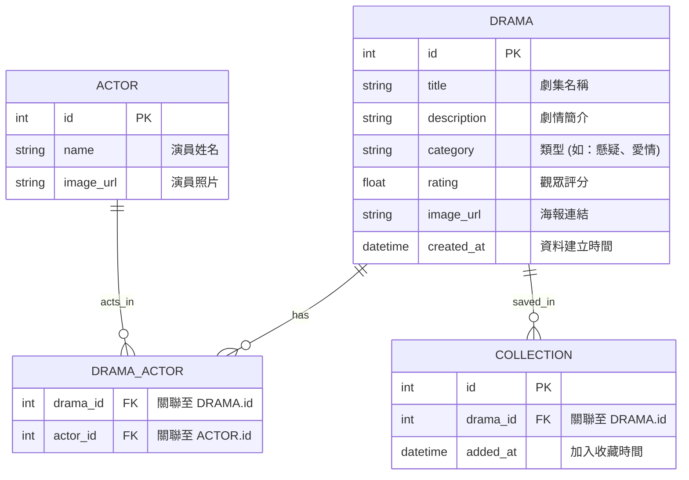

# 追劇推薦系統資料庫設計文件 (Database Design)

本文件定義了「追劇推薦系統」的 SQLite 資料庫結構、關聯與實作方式。

## 1. ER 圖 (Entity-Relationship Diagram)

使用 Mermaid 語法描述資料表之間的關聯：

---

## 2. 資料表詳細說明

### DRAMA (劇集表)
| 欄位名稱 | 型別 | 說明 | 必填 | 備註 |
| :--- | :--- | :--- | :--- | :--- |
| id | INTEGER | 主鍵 | 是 | AUTOINCREMENT |
| title | TEXT | 劇集名稱 | 是 | |
| description | TEXT | 劇情詳細描述 | 否 | |
| category | TEXT | 劇集類型 | 是 | 以字串存儲 |
| rating | REAL | 觀眾平均評分 | 否 | 0.0 ~ 10.0 |
| image_url | TEXT | 海報圖片路徑或網址 | 否 | |
| created_at | TIMESTAMP | 建立時間 | 是 | 預設為 CURRENT_TIMESTAMP |

### ACTOR (演員表)
| 欄位名稱 | 型別 | 說明 | 必填 | 備註 |
| :--- | :--- | :--- | :--- | :--- |
| id | INTEGER | 主鍵 | 是 | AUTOINCREMENT |
| name | TEXT | 演員姓名 | 是 | |
| image_url | TEXT | 演員照片連結 | 否 | |

### DRAMA_ACTOR (劇集-演員關聯表)
| 欄位名稱 | 型別 | 說明 | 必填 | 備註 |
| :--- | :--- | :--- | :--- | :--- |
| drama_id | INTEGER | 劇集 ID | 是 | 外鍵，參照 DRAMA.id |
| actor_id | INTEGER | 演員 ID | 是 | 外鍵，參照 ACTOR.id |

### COLLECTION (個人收藏清單)
| 欄位名稱 | 型別 | 說明 | 必填 | 備註 |
| :--- | :--- | :--- | :--- | :--- |
| id | INTEGER | 主鍵 | 是 | AUTOINCREMENT |
| drama_id | INTEGER | 劇集 ID | 是 | 外鍵，參照 DRAMA.id |
| added_at | TIMESTAMP | 加入時間 | 是 | 預設為 CURRENT_TIMESTAMP |

---

## 3. SQL 建表語法

完整 SQL 請見：[database/schema.sql](file:///c:/Users/User/Desktop/web_app_development2/database/schema.sql)

---

## 4. Python Model 實作

本專案使用 `sqlite3` 進行資料庫操作，每個 Model 封裝了對應的 CRUD 方法：

- **Drama Model**: [app/models/drama.py](file:///c:/Users/User/Desktop/web_app_development2/app/models/drama.py)
- **Actor Model**: [app/models/actor.py](file:///c:/Users/User/Desktop/web_app_development2/app/models/actor.py)
- **Collection Model**: [app/models/collection.py](file:///c:/Users/User/Desktop/web_app_development2/app/models/collection.py)
