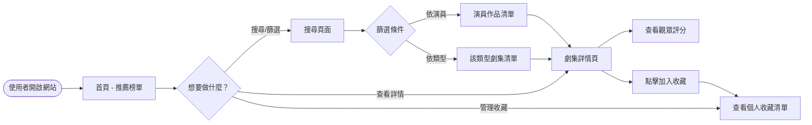
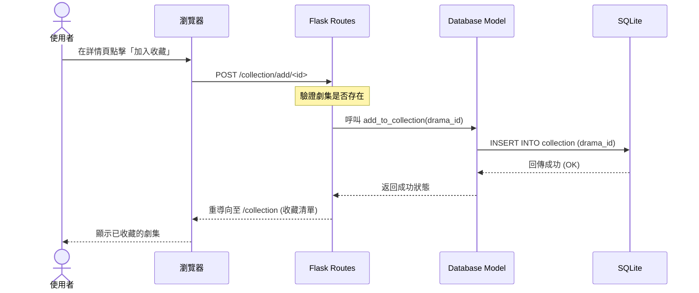

# 追劇推薦系統流程圖文件 (Flowchart Document)

本文件使用 Mermaid 語法描述「追劇推薦系統」的使用者操作路徑與系統資料流向。

## 1. 使用者流程圖 (User Flow)

描述使用者進入系統後的主要操作路徑：

---

## 2. 系統序列圖 (Sequence Diagram)

以「**加入收藏清單**」功能為例，描述前端與後端元件的互動：

---

## 3. 功能清單對照表

以下為系統主要功能與對應的技術實作路徑：

| 功能名稱 | URL 路徑 | HTTP 方法 | 說明 |
| :--- | :--- | :--- | :--- |
| **首頁/推薦榜單** | `/` | `GET` | 顯示 Top 10 熱門劇集與最新推薦。 |
| **搜尋與篩選** | `/search` | `GET` | 處理關鍵字、演員名稱、劇集類型的篩選。 |
| **劇集詳情** | `/drama/<int:id>` | `GET` | 顯示劇集詳細資訊、演員清單與評分。 |
| **加入收藏** | `/collection/add/<int:id>` | `POST` | 將指定劇集加入使用者的「想看清單」。 |
| **我的收藏** | `/collection` | `GET` | 列出使用者所有已收藏的劇集。 |
| **移除收藏** | `/collection/remove/<int:id>` | `POST` | 從清單中移除特定劇集。 |

---

## 4. 流程說明

- **首頁驅動**：使用者一進入網站即可看到熱門榜單，這是為了解決「不知看什麼」的痛點。
- **快速轉換**：在搜尋結果或詳情頁面，皆提供明顯的「收藏」按鈕，減少使用者操作步驟。
- **同步反饋**：收藏動作完成後，系統會引導使用者至收藏清單，確保操作結果可視化。
